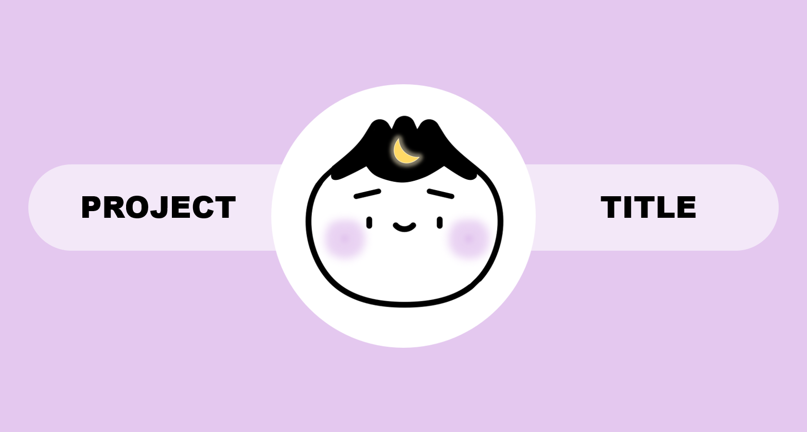
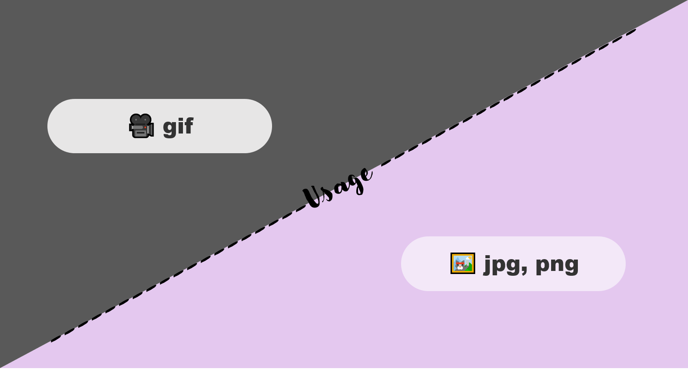

# Awesome README Template

<!--Badges-->
![MIT License][license-shield] ![Repository Size][repository-size-shield] ![Issue Closed][issue-closed-shield]

<!--Project Buttons-->
 [![Readme in Korean][readme-ko-shield]][readme-ko-url] [![View Demo][view-demo-shield]][view-demo-url] [![Report bug][report-bug-shield]][report-bug-url] [![Request feature][request-feature-shield]][request-feature-url]

<!--Project Title Image-->


# Table of Contents
- [[1] Project Overview](#1-project-overview)
  - [Key Features](#key-features)
- [[2] Technical Overview](#2-technical-overview)
  - [Tech Stack](#tech-stack)
  - [Architecture](#architecture)
- [[3] Getting Started](#3-getting-started)
  - [Prerequisites](#prerequisites)
  - [Installation](#installation)
  - [Configuration](#configuration)
  - [Running the App](#running-the-app)
- [[4] User Guide](#4-user-guide)
  - [Documentation](#documentation)
  - [Examples](#examples)
- [[5] Trouble Shooting](#5-trouble-shooting)
- [[6] Roadmap](#6-roadmap)
- [[7] Contribution](#7-contribution)
- [[8] Acknowledgement](#8-acknowledgement)
- [[9] Contact](#9-contact)
- [[10] License](#10-license)

# [1] Project Overview
> 💡 Summarize your project in 2~3 sentences, considering what your project is about, why it's needed, which problem it solves and who the target audience is.

This project is a well-structured README template designed to help developers create a clear and consistent documentation for their projects. It addresses the common challenge of writing comprehensive README files by providing an easy-to-use template that ensures all essential details are included.

## Key Features
> 💡 Highlight the core functionality and unique strengths of your project.
- 📄 **Well-Structured Layout**: This template provides a clean, organized structure that can be easily customized for any project, ensuring that all essential sections are covered.
- 💡 **Guidelines for Each Section**: Each section includes helpful guidelines, making it easier for users to fill in the relevant information.
- 🌍 **Language Support**: The template is available in multiple languages, with badges to switch between them, making it accessible to a global audience.


# [2] Technical Overview
> 💡 Depending on your project, you may consider including some of the sections such as Deployment Strategy, Security, Scalability&Reliability and Monitoring&Observility.

## Tech Stack
> 💡 Specify the languages, frameworks, and key libraries used in the project, along with their respective versions.
- [Maven](https://maven.apache.org/) 3.6.3
- [MySQL](https://www.mysql.com/) 8.0
- [Spring](https://spring.io/) 2.4.3

## Architecture


# [3] Getting Started
> 💡 If your program behaves differently across operating systems, provide OS-specific instructions where necessary.
## Prerequisites
> 💡 List the tools and libraries required to run the project, and briefly explain how to install them.
- [OpenWeather API key](https://openweathermap.org/) for free
- npm
```bash
npm install npm@latest -g
```

## Installation
> 💡 Describe how to obtain and set up the project source code.
1. Clone the repository
```bash
git clone https://github.com/your-username/project-repository
```
2. Install NPM packages
```bash
npm install
```

## Configuration
> 💡 Explain where and how to insert required configuration values.
- Enter Openweather API key in `config.js`
```bash
const API_KEY = "<Your API key>";
```

## Running the App
> 💡 Provide instructions for starting the application in a local environment.
```bash
npm run start
```

# [4] User Guide
> 💡 Depending on your project, you may consider including some of the sections such as Integration Guide, API Usage, Testing and Advanced Configuration.
## Documentation
> 💡 Provide a link to external documentation here, if available.
- 📔 [API Documentation](https://devyoujin.github.io) 

## Examples


```go
// Show useful code examples of some of your APIs 
```


# [5] Trouble Shooting
> 💡 List the FAQs and explain how to get help if the issue isn’t covered there.

If your issue isn't addressed in the FAQ, please don't hesitate to reach out for further support. You can open an issue on [GitHub Issues][trouble-shooting-url]

**Error: API Key Missing**
- Cause: This occurs when the required API key is not set or is invalid.
- Solution: Ensure that you've set the `API_KEY` environment variable in your `config.js` file. Double-check that your API key is correct and hasn't expired.


# [6] Roadmap
|Milestone|Estimated Timeline|Details|
|---|---|---|
|v1.1.0|May 2025|Improve UI/UX based on user feedback|
|v2.0.0|June 2025|Integrate with payment providers|
|v2.1.0|July 2025|Optimize the site for mobile devices|


# [7] Contribution
> 💡 Emoji guide: ✨(New Feature)
🐞(Bug Fix), 📄(Documentation), 🔨(Refactoring), ⚡️(Performance), 🔒(Security), 💡(Suggestion/Idea)

Any contributions to this project are highly valued and appreciated. For detailed guidelines on how to contribute, please refer to the [`contribution guide`][contribution-url].

A big thank you to all the amazing contributors who’ve helped make this project better. Your efforts are truly appreciated! 🙌
- 🐞 [YOUJIN LEE(devyoujin)](https://github.com/devyoujin): Fix bug on the main page


# [8] Acknowledgement
> 💡 Include links to any sources, such as relevant repositories or blog posts, that inspired you to build this project.
- [Readme Template - Embedded Artistry](https://embeddedartistry.com/blog/2017/11/30/embedded-artistry-readme-template/)
- [How to write a kickass Readme - James.Scott](https://dev.to/scottydocs/how-to-write-a-kickass-readme-5af9)
- [Best-README-Template - othneildrew](https://github.com/othneildrew/Best-README-Template#prerequisites)
- [Img Shields](https://shields.io/)
- [Github Pages](https://pages.github.com/)
- [Draw.io](https://app.diagrams.net/)


# [9] Contact
- 📧 youjin.lee.dev@gmail.com
- 📋 [Contact Form](https://devyoujin.github.io/contact)


# [10] License
This project is licensed under the MIT License. See the [`LICENSE`][license-url] for more information.


<!--URL for Badges-->
[license-shield]: https://img.shields.io/github/license/devyoujin/awesome-readme-template?labelColor=D8D8D8&color=04B4AE
[repository-size-shield]: https://img.shields.io/github/repo-size/devyoujin/awesome-readme-template?labelColor=D8D8D8&color=BE81F7
[issue-closed-shield]: https://img.shields.io/github/issues-closed/devyoujin/awesome-readme-template?labelColor=D8D8D8&color=FE9A2E

<!--URL for Buttons-->
[readme-ko-shield]: https://img.shields.io/badge/-readme%20in%20korean-2E2E2E?style=for-the-badge
[view-demo-shield]: https://img.shields.io/badge/-%F0%9F%98%8E%20view%20demo-F3F781?style=for-the-badge
[view-demo-url]: https://devyoujin.github.io
[report-bug-shield]: https://img.shields.io/badge/-%F0%9F%90%9E%20report%20bug-F5A9A9?style=for-the-badge
[report-bug-url]: https://github.com/devyoujin/awesome-readme-template/issues
[request-feature-shield]: https://img.shields.io/badge/-%E2%9C%A8%20request%20feature-A9D0F5?style=for-the-badge
[request-feature-url]: https://github.com/devyoujin/awesome-readme-template/issues

<!--URL for Links-->
[trouble-shooting-url]: https://github.com/devyoujin/awesome-readme-template/issues
[license-url]: LICENSE.md
[contribution-url]: CONTRIBUTION.md
[readme-ko-url]: README-KO.md
